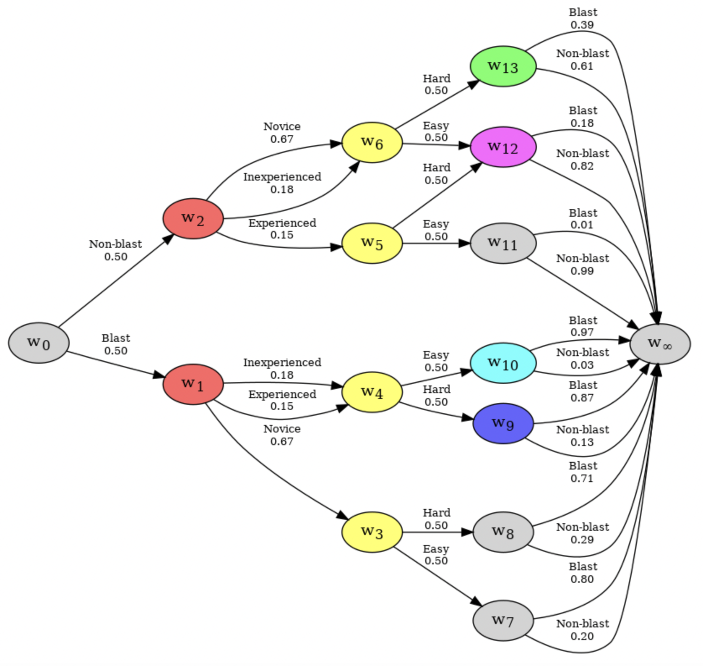

# cegpy

Cegpy (/segpaɪ/) is a Python package for working with Chain Event Graphs. It supports learning the graphical structure of a Chain Event Graph from data, encoding of parametric and structural priors, estimating its parameters, and performing inference.

It is built on top of the Python network modelling package [NetworkX](https://networkx.org/ "https://networkx.org/").

## Documentation

Documentation is hosted on [read the docs](https://cegpy.readthedocs.io/en/stable/ "https://cegpy.readthedocs.io/en/stable/").

We have also written a paper to explain the statistical methods and algorithms included in the package;
[ARXIV - cegpy: Modelling with Chain Event Graphs in Python](https://arxiv.org/abs/2211.11366 "https://arxiv.org/abs/2211.11366").

### Quickstart

If you'd like to get started using the packages, the best place to start is the [quick-start documentation](https://cegpy.readthedocs.io/en/latest/quickstart/quickstart_st.html "https://cegpy.readthedocs.io/en/latest/quickstart/quickstart_st.html").

## Example Binder

Use cases have been demonstrated in a [binder](https://github.com/peterrhysstrong/cegpy-binder).

The following image is an example of a chain event graph that is produced by this package:

## Contributors ✨

Thanks goes to these wonderful people ([emoji key](https://allcontributors.org/docs/en/emoji-key)):

<!-- ALL-CONTRIBUTORS-LIST:START - Do not remove or modify this section -->

<!-- prettier-ignore-start -->

<!-- markdownlint-disable -->

<table>
  <tr>
      <td align="center"><a href="https://ashenvi10.github.io/"> <b>Aditi Shenvi</b></a> <a href="https://github.com/g-walley/cegpy/commits?author=ashenvi10" title="Code">💻</a> <a href="https://github.com/g-walley/cegpy/commits?author=ashenvi10" title="Tests">⚠️</a> <a href="https://github.com/g-walley/cegpy/issues?q=author%3Aashenvi10" title="Bug reports">🐛</a> <a href="#projectManagement-ashenvi10" title="Project Management">📆</a></td>
    <td align="center"><a href="https://github.com/g-walley"> <b>Gareth Walley</b></a> <a href="https://github.com/g-walley/cegpy/commits?author=g-walley" title="Code">💻</a> <a href="https://github.com/g-walley/cegpy/commits?author=g-walley" title="Documentation">📖</a> <a href="#design-g-walley" title="Design">🎨</a> <a href="https://github.com/g-walley/cegpy/commits?author=g-walley" title="Tests">⚠️</a> <a href="#maintenance-g-walley" title="Maintenance">🚧</a></td>
    <td align="center"><a href="https://github.com/Kaasiak"> <b>Kasia Kobalczyk</b></a> <a href="https://github.com/g-walley/cegpy/commits?author=Kaasiak" title="Code">💻</a> <a href="https://github.com/g-walley/cegpy/issues?q=author%3AKaasiak" title="Bug reports">🐛</a> <a href="https://github.com/g-walley/cegpy/commits?author=Kaasiak" title="Tests">⚠️</a></td>
    <td align="center"><a href="https://github.com/peterrhysstrong"> <b>Peter Strong</b></a> <a href="https://github.com/g-walley/cegpy/commits?author=peterrhysstrong" title="Code">💻</a> <a href="https://github.com/g-walley/cegpy/issues?q=author%3Apeterrhysstrong" title="Bug reports">🐛</a> <a href="#example-peterrhysstrong" title="Examples">💡</a> <a href="https://github.com/g-walley/cegpy/commits?author=peterrhysstrong" title="Tests">⚠️</a></td>
  </tr>
</table>

<!-- markdownlint-restore -->

<!-- prettier-ignore-end -->

<!-- ALL-CONTRIBUTORS-LIST:END -->

This project follows the [all-contributors](https://github.com/all-contributors/all-contributors) specification. Contributions of any kind welcome!
